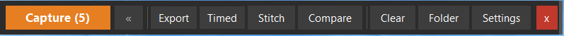
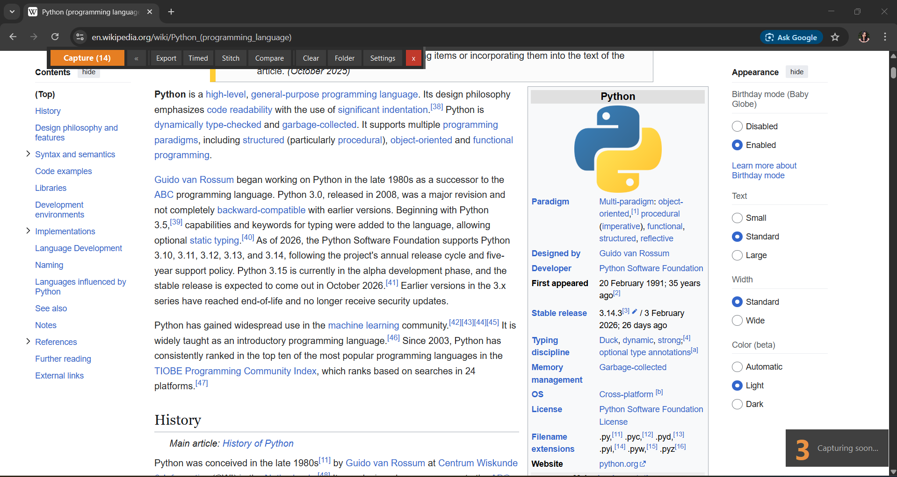
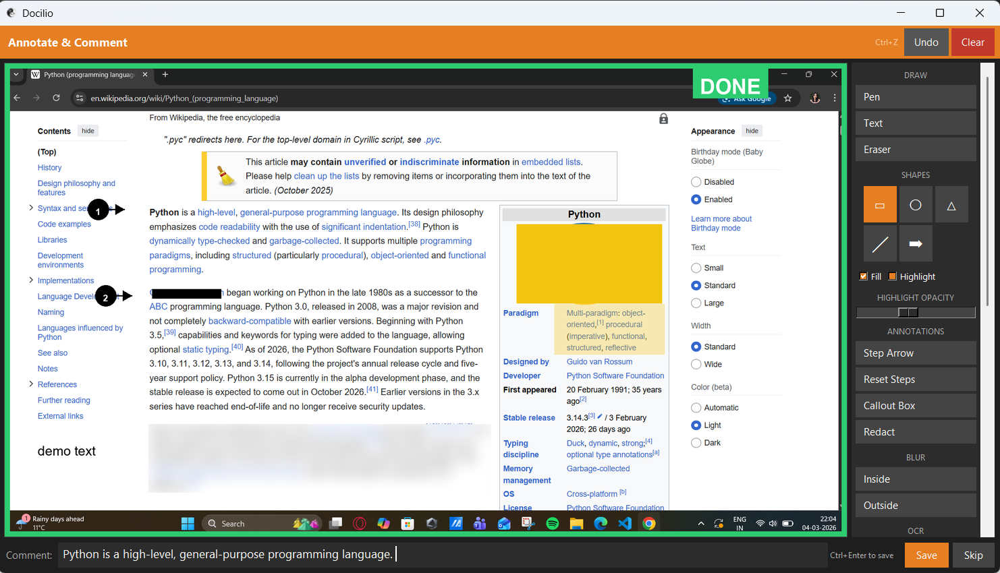
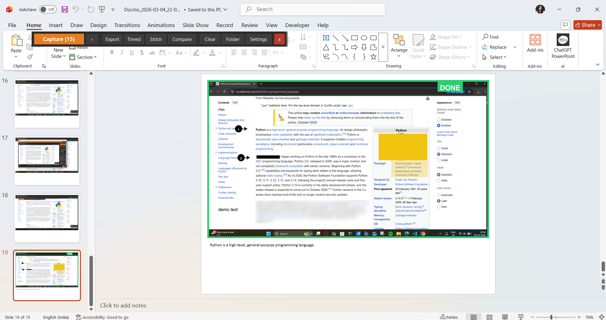
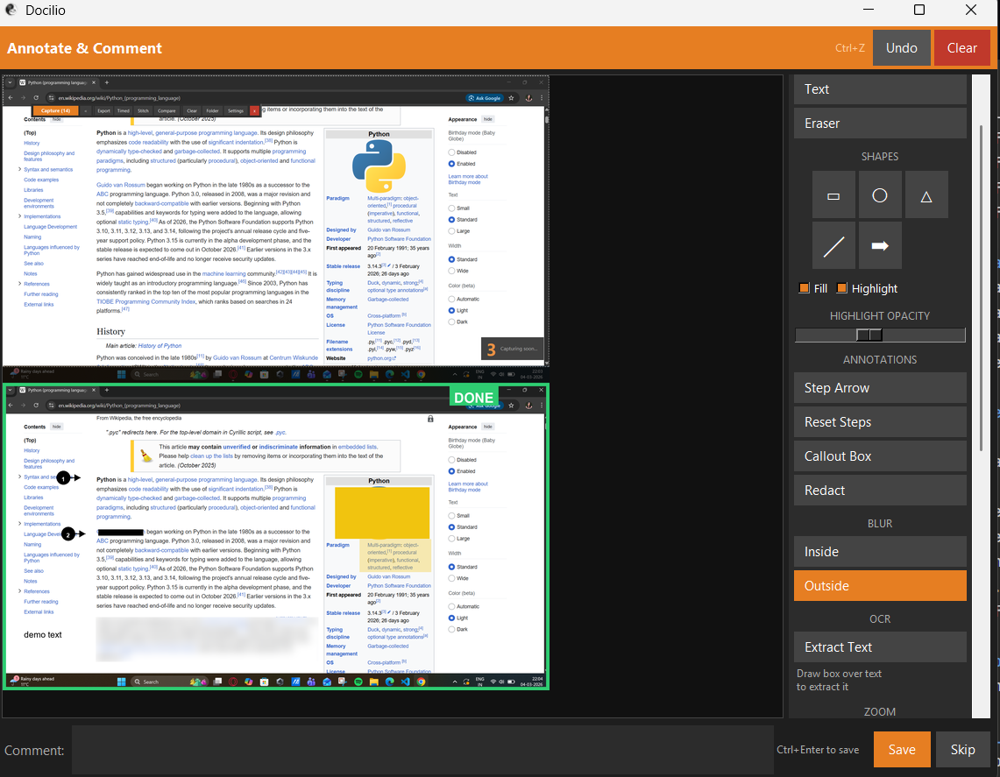
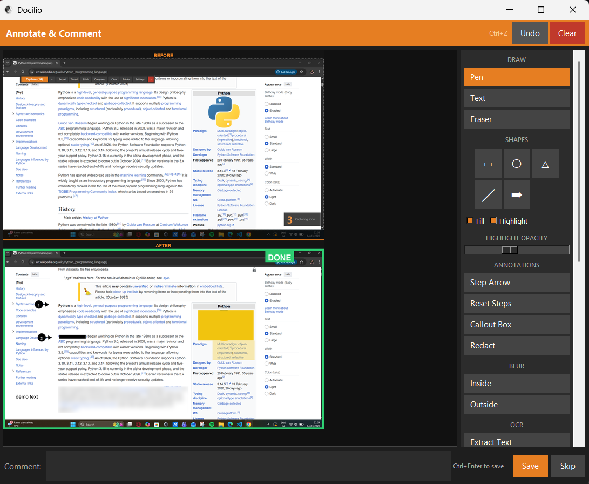
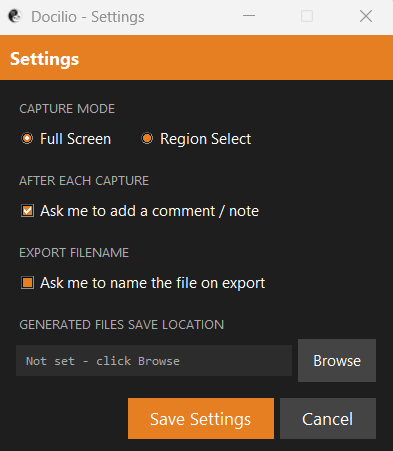

# Docilio

### Screenshot documentation built on privacy, efficiency and ease.



Docilio is a lightweight Windows tool that sits as a small toolbar at the top of your screen. You capture, annotate, and export. Everything in one flow, without opening a single other application.

It runs entirely on your machine. No internet, no account, no cloud. What you capture stays with you.

---

## Who it is for

You will get the most out of Docilio if you regularly need to show someone else how something works.

- QA engineers documenting bugs and test steps
- Trainers and educators building guides and course material
- IT and support teams writing SOPs
- Consultants producing handover documentation
- Social media coaches creating walkthroughs and tutorials
- Anyone whose afternoon disappears into moving screenshots between applications

---

## How it works

**1. Capture**

Click Capture, use the Alt+X hotkey, or set a timed delay and let it fire automatically. Every capture opens straight into the annotator.

- Full screen or region selection
- Timed capture with a countdown you set
- Global hotkey works from anywhere on screen



**2. Annotate**

Everything you need is in one panel. No switching tools, no separate editor.

*Mark up*
- Pen, text, shapes (rectangle, circle, triangle, line, arrow)
- Adjustable stroke width and colour

*Draw attention*
- Highlight entire regions of a screenshot with a semi transparent colour box, not just text like in Word, but any area you choose
- Numbered step arrows that auto increment, no manual numbering
- Callout boxes with a pointer tail for annotating specific spots with context

*Hide sensitive content*
- Blur inside or outside a selected area
- Full black redaction for anything that should not be visible

*Extract content*
- OCR: drag a box over any text on screen and it lands directly in your comment, no retyping

*Templates*
- Bug Report, Step Complete, Important, Confidential, Custom Watermark, Clean Border

*Full controls*
- Undo and redo (Ctrl+Z / Ctrl+Y)
- Eraser, zoom, fill toggle, highlight opacity



**3. Export**

Hit Export when you are done. Docilio compiles every screenshot and comment into one clean document. You never open Word, Excel, PowerPoint or a PDF editor. It just builds the file.

- Word (.docx)
- Excel (.xlsx)
- PDF
- PowerPoint (.pptx)



---

## More tools

**Stitch** — combine multiple screenshots into one long image. Useful for showing a full page, a complete user flow, or anything that spans more than one screen.



**Compare** — pick any two screenshots as Before and After. Docilio generates a stacked comparison with a divider and labels automatically.



---

## Privacy

Everything runs locally. No telemetry, no analytics, no login, no data leaving your machine. Your captures are stored in a local folder you control entirely.

This was not an afterthought. A lot of what gets documented at work is confidential and this tool was built with that in mind from the start.

---

## Getting started

### Download and run

1. Go to the [Releases](../../releases) page
2. Download the latest `Docilio.zip`
3. Unzip anywhere
4. Double click `Docilio.exe`

No Python. No installs. Nothing else.

> Windows will show a security prompt on first launch. This is expected. The Alt+X hotkey requires elevated permissions to work across all applications. You can skip it and use everything else through the toolbar normally.

### Run from source

```bash
git clone https://github.com/Mariia-Faustina/Docilio.git
cd Docilio
pip install -r requirements.txt
python main.py
```

### Build the exe yourself

```bash
pip install -r requirements.txt
```

Run `build.bat`. It compiles everything into `dist\Docilio\` and creates a desktop shortcut automatically. First build takes a few minutes, faster after that.

---

## Settings

Click Settings in the toolbar to configure capture mode, whether the annotator opens automatically, export filename preferences, and where files get saved.



---

## Known limitations

- Windows only. Mac support is on the roadmap.
- First launch from the exe takes a moment to start, this is a PyInstaller limitation not a bug
- OCR requires [Tesseract](https://github.com/UB-Mannheim/tesseract/wiki) installed separately

---

## Commercial use

Free for personal and non-commercial use. If you want Docilio for your team or a version built around how your company works, get in touch.

[linkedin.com/in/prathiksha-maria-faustina](https://in.linkedin.com/in/prathiksha-maria-faustina)

---

## License

Personal and non-commercial use only. See [LICENSE](LICENSE) for details.

---

